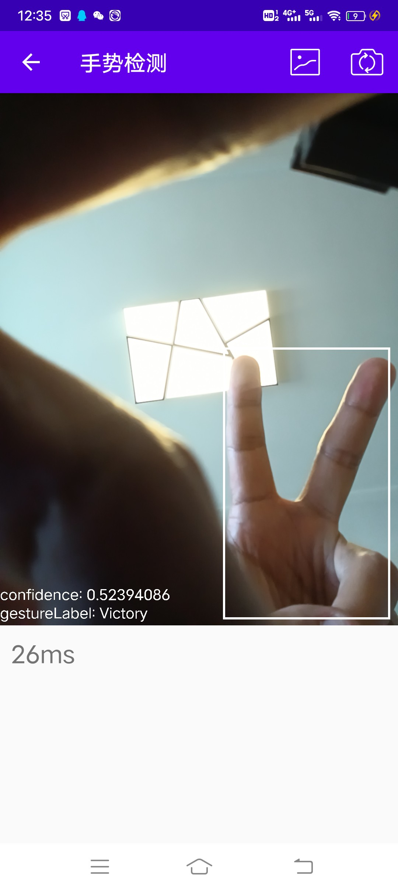
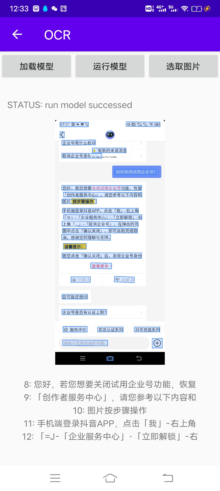

# LiteKitAndroidDemo
LiteKit Android Demo based on Paddle Lite

本项目是抽取 https://github.com/PaddlePaddle/LiteKit](https://github.com/PaddlePaddle/LiteKit ）其中的Android demo 源码
再加上编译好的LiteKit aar库。 可以直接编译测试通过。方便对飞桨平台有兴趣的真接修改。

### 效果展示
| 主界面 | 手势识别 | OCR |  视频超分 |
| --- | --- |--- |--- |
| 

 | 

 |

 |

 |

